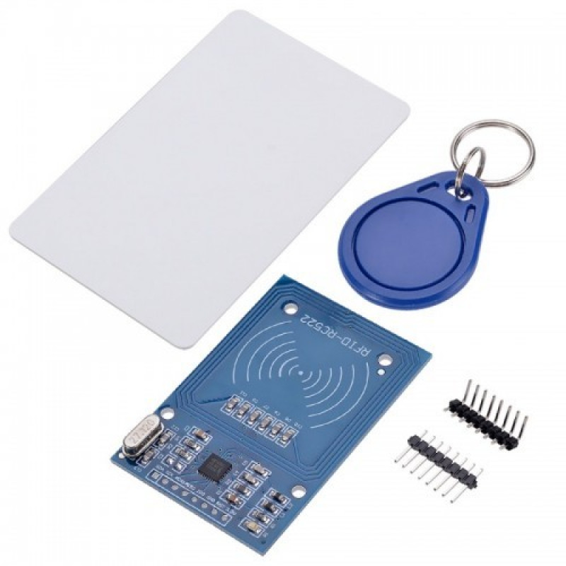
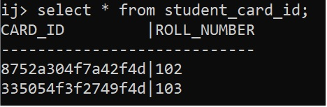
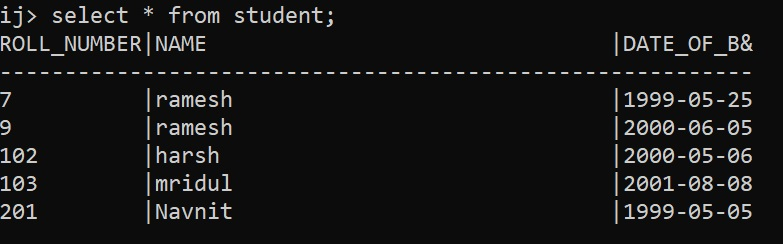

# RFID Application
This is an IoT project in which I created a scenario of a school in which the data of students is available on the database (roll number, name, date of birth) and I have to provide a card (RFID card) to each student. so, that it is easier to take attendance and provide proper identification.

### Module Used 
This is RC522 RFID 13.56MHZ Reader Writer Module.

This is Arduino-Nano


## How it Works ?
#### connections
```
RFID Module <---> Arduino Nano
     SDA    <--->   D10
     SCK    <--->   D13 
     MOSI   <--->   D11
     MISO   <--->   D12
     GND    <--->   GND
     RST    <--->   D3
     3.3v   <--->   3v3
```
***Design***
The root idea behind the implementation of this application is to generate a unique id of 16 characters and set these characters bytes in the card's 16 blocks (using RFID), and also maintain a table of id and roll number (roll number is system generated, primary key).



In the case of the reading card, we read those bytes (character's bytes)  and then create an id by using all  16 bytes and then search for id in the student_card_id table, if it exists then we get details of the student from the database by using roll number(as primary key).




